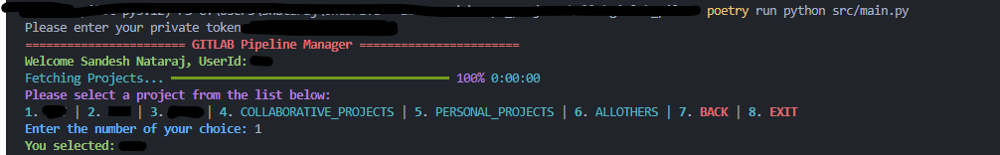
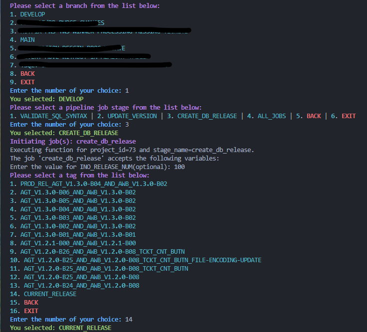
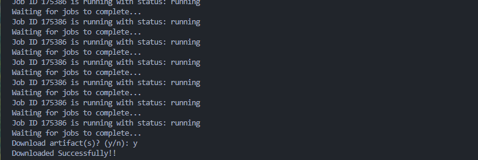

Perfect 👍 — here’s your polished README with **screenshot/GIF placeholders** added in the right spots and captions that make the repo look professional and showcase-ready.

---

# **GitLab Pilot 🚀**

*A Python-powered CLI to automate GitLab CI/CD pipeline management*

## **Overview**

**GitLab Pilot** is a developer-friendly **Python CLI tool** that streamlines GitLab **CI/CD pipeline operations**.
Instead of manually navigating the GitLab UI, this tool provides a **centralized, command-line workflow** for:

* **Triggering pipelines**
* **Managing pipeline variables**
* **Downloading artifacts**
* **Navigating jobs/stages directly from `.gitlab-ci.yml`**

<p align="center">  
    
</p>  

> *Screenshot: CLI main menu listing projects available in GitLab.*

---

## **Key Features**

✅ Trigger GitLab pipelines **directly from the CLI** (no UI clicks required).
✅ Dynamically **input and manage CI/CD variables** at runtime.
✅ **Browse and select projects/subprojects** interactively.
✅ Automatically **parse `.gitlab-ci.yml`** to list available jobs and stages.
✅ **Download artifacts** from completed pipelines straight into your local `downloads/` folder.
✅ **Monitor pipeline progress** in real-time within the CLI.
✅ Built to be **extensible** — easily add new GitLab API interactions.

---

## **Installation & Setup**

### **1. Clone the Repository**

```sh
git clone git@github.com:sandeshbnataraj/gitlab_pilot.git
cd gitlab_pilot
```

### **2. Install Poetry (if not installed)**

```sh
pip install poetry
```

### **3. Install Dependencies with Poetry**

```sh
poetry install
```

### **4. Configure Environment Variables**

Create a `.env` file in the project root with your GitLab credentials:

```ini
GITLAB_BASE_URL=https://gitlab.com
GITLAB_PRIVATE_TOKEN=your_private_token
```

> 🔹 **Note:** Generate a private token under
> `Settings > Access Tokens` with the scopes: `api`, `read_repository`, `write_repository`.

### **5. Activate the Virtual Environment**

```sh
poetry shell
```

---

## **Usage**

Run the application with:

```sh
poetry run python main.py
```

### **Workflow Example**

1. **Select a project** → The CLI lists all projects in your GitLab account.
2. **Choose a subproject** → Navigate into specific repositories.
3. **Trigger pipelines** → CLI reads `.gitlab-ci.yml` and shows jobs/stages you can trigger.
4. **Input variables** → Enter runtime variables when prompted.
5. **Monitor status** → See pipeline progress live in the terminal.
6. **Download artifacts** → Save build outputs to your local `downloads/` folder.

<p align="center">  
    
</p> 

<p align="center">  
    
</p> 

> *GIF: Selecting a project, triggering a pipeline, entering variables, and downloading artifacts.*

⚡ Note: Pipelines must allow **API triggers**; disabled jobs won’t run via CLI.

---

## **Contributing**

We welcome contributions 🙌

1. Fork this repo
2. Create a branch → `git checkout -b feature-name`
3. Commit changes → `git commit -m "Add feature XYZ"`
4. Push → `git push origin feature-name`
5. Open a Pull Request 🚀

---

## **Maintainer & Contact**

👤 **Sandesh Nataraj**
📧 [sandeshb.nataraj@gmail.com](mailto:sandeshb.nataraj@gmail.com)

